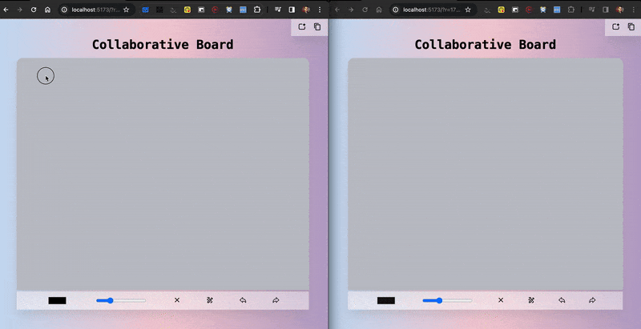

# Collaborative Board

This is collaborative board where users can draw on a shared board. The drawings are synchronized in real-time, allowing multiple users to collaborate and interact with the board simultaneously.

## Features

- Real-time collaboration on a shared board.
- Ability to draw free-form lines on the board.
- Undo and redo functionality.
- Private Rooms.
- Added support for drawing with touches in mobile devices.

## Demo

Live Demo: https://collaborative-board.vercel.app

Open [this](https://collaborative-board.vercel.app?r=2342342334343) in two tabs or windows of your browser. Draw anything on any canvas, they should auto-sync with each others.




## Installation

Using npm:

```bash
  npm install
```

Using Yarn:

```bash
  yarn
```

## Quick Start

Using npm:

```bash
  npm run dev
```

Using Yarn:

```bash
  yarn dev
```

## Contributing

Contributions are always welcome! If you have suggestions for improvements or find any bugs, feel free to open an issue or submit a pull request. Please ensure your changes are well-documented and adhere to the project's coding standards.
